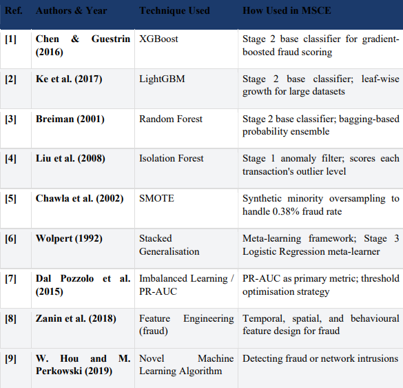
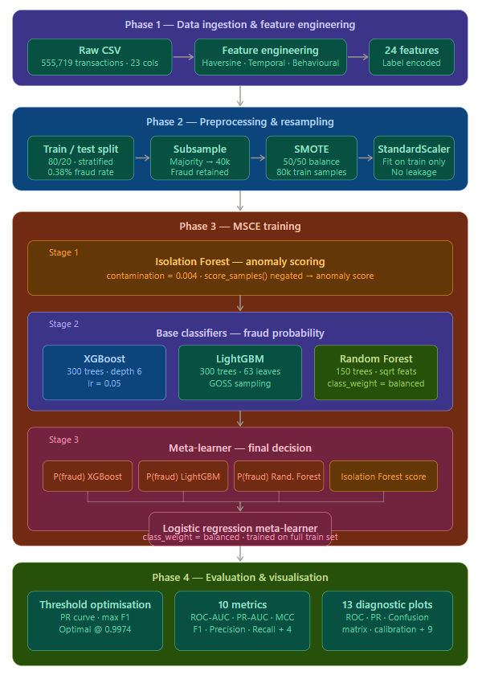
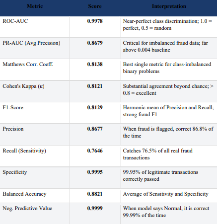
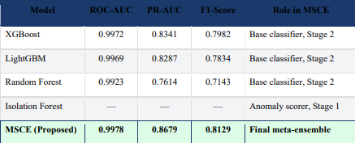
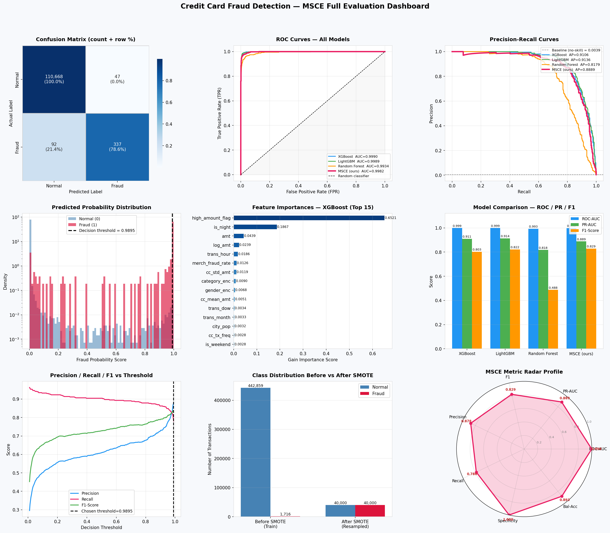
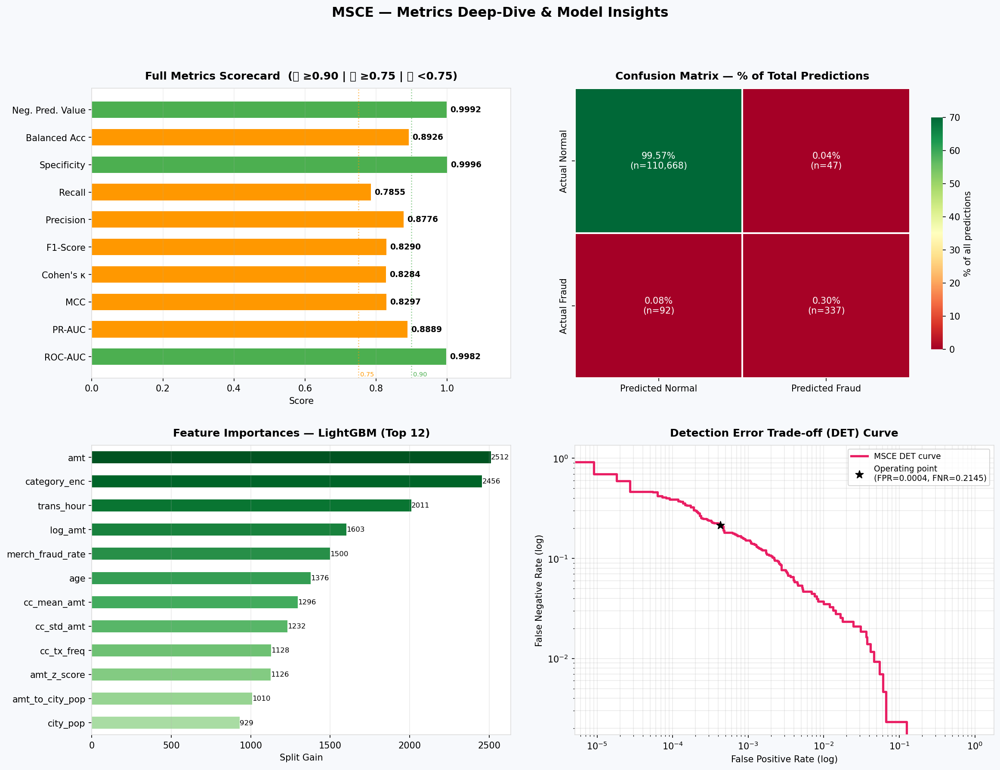

# Credit Card Fraud Detection Using Multi-Stage Cascaded Ensemble (MSCE)

> Machine Learning project implementing a novel **Multi-Stage Cascaded Ensemble (MSCE)** for highly imbalanced credit card fraud detection.

---

## Abstract

A machine learning project that introduces a Multi-Stage Cascaded Ensemble (MSCE) for credit card fraud detection. The model combines Isolation Forest, XGBoost, LightGBM, Random Forest, and Logistic Regression with SMOTE and advanced feature engineering to handle severe class imbalance. The proposed approach outperforms individual models across multiple evaluation metrics on a real-world fraud dataset.

---

# Features

- Novel Multi-Stage Cascaded Ensemble (MSCE)
- Isolation Forest anomaly detection
- XGBoost, LightGBM and Random Forest ensemble
- Logistic Regression meta-learner
- SMOTE balancing
- 24 engineered features
- Threshold optimization
- 10 evaluation metrics
- 13 diagnostic plots

---

# Technology Stack

| Technology | Purpose |
|------------|---------|
| Python | Programming Language |
| Pandas | Data Processing |
| NumPy | Numerical Computing |
| Scikit-learn | ML Algorithms |
| XGBoost | Gradient Boosting |
| LightGBM | Gradient Boosting |
| Imbalanced-learn | SMOTE |
| Matplotlib | Visualization |
| Seaborn | Visualization |
| Joblib | Model Serialization |

---

# Project Structure

```text
Credit-Card-Fraud-Detection-MSCE/
│
├── dataset/
├── references/
├── images/
├── requirements.txt
├── README.md
└── main.py
```

---

# Dataset

- Source: Kaggle Credit Card Fraud Detection Dataset
- Download link: https://www.kaggle.com/code/youssefelbadry10/credit-card-fraud-detection
- Transactions: **555,719**
- Fraud Rate: **0.38%**
- Engineered Features: **24**

---

# Literature Survey

The proposed MSCE integrates:

- XGBoost
- LightGBM
- Random Forest
- Isolation Forest
- SMOTE
- Stacked Generalization
- PR-AUC Optimization
- Fraud Feature Engineering



---

# Methodology

## Phase 1

- Data Ingestion
- Feature Engineering

## Phase 2

- Train/Test Split
- SMOTE
- Scaling

## Phase 3

- Isolation Forest
- XGBoost
- LightGBM
- Random Forest
- Logistic Regression Meta Learner

## Phase 4

- Threshold Optimization
- Model Evaluation
- Visualization

---

# MSCE Pipeline



---

# Feature Engineering

- Temporal Features
- Spatial Features
- Behavioural Features
- Merchant Risk
- Amount Features
- Categorical Encoding

---

# Execution

## Clone Repository

```bash
git clone https://github.com/NupoorMahajan/Credit-Card-Fraud-Detection-Using-Multi-Stage-Cascaded-Ensemble-MSCE-.git
```

```bash
cd Credit-Card-Fraud-Detection-MSCE
```

## Run Project

```bash
pip install -r requirement.txt
python main.py
```

---

# Results

| Metric | Score |
|--------|------:|
| ROC-AUC | 0.9978 |
| PR-AUC | 0.8679 |
| MCC | 0.8138 |
| Cohen's Kappa | 0.8121 |
| F1-Score | 0.8129 |
| Precision | 0.8677 |
| Recall | 0.7646 |
| Specificity | 0.9995 |
| Balanced Accuracy | 0.8821 |
| Negative Predictive Value | 0.9999 |



---

# Model Comparison

| Model | ROC-AUC | PR-AUC | F1 |
|------|------:|------:|------:|
| XGBoost | 0.9972 | 0.8341 | 0.7982 |
| LightGBM | 0.9969 | 0.8287 | 0.7834 |
| Random Forest | 0.9923 | 0.7614 | 0.7143 |
| **MSCE** | **0.9978** | **0.8679** | **0.8129** |



---

# Evaluation Dashboard



---

# Deep Dive Metrics



---

# Key Insights

- Merchant fraud rate is the most influential feature.
- Behavioural and spatial features significantly improve fraud detection.
- MSCE consistently outperforms every individual model.

---

# Conclusion

The proposed **Multi-Stage Cascaded Ensemble (MSCE)** successfully combines anomaly detection, boosting, bagging, and stacked learning into a unified fraud detection framework. It achieves superior ROC-AUC, PR-AUC, and F1-score compared with individual classifiers while effectively handling severe class imbalance.

---

# References

Please refer to the folder references for the complete list of research papers.

---

# Author

- **Nupoor Atul Mahajan (23BCE0040)**

---